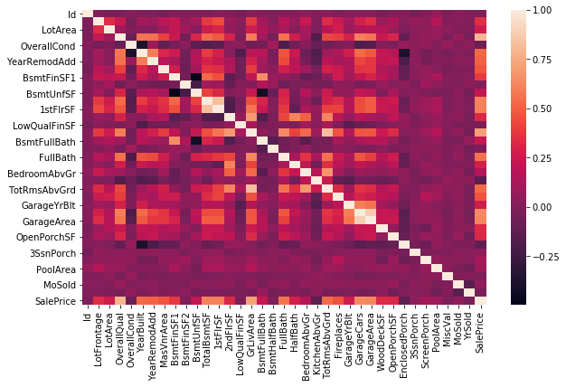
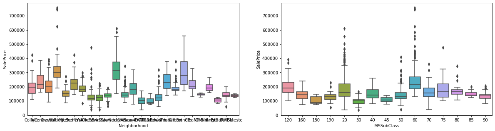
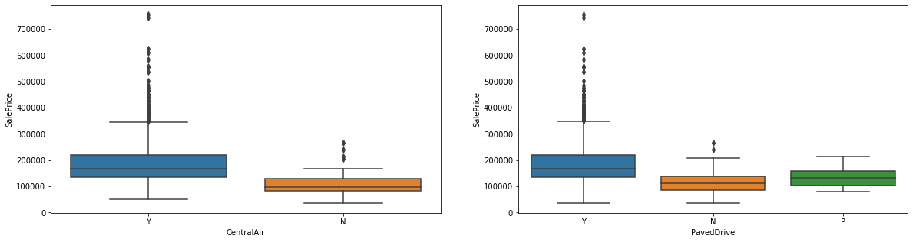
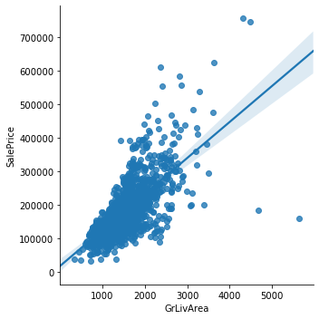
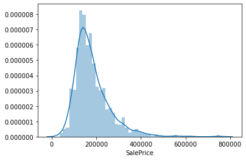
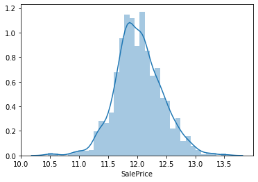

# Categorical correlation, RFR and XGBoost
### Link to Kaggle Kernel: https://www.kaggle.com/matheuscoradini/categorical-correlation-rfr-and-xgboost


```python
import pandas as pd
from matplotlib import pyplot as plt
import seaborn as sns
from sklearn.model_selection import cross_val_score
from sklearn.ensemble import RandomForestRegressor
from sklearn.model_selection import train_test_split
from xgboost import XGBRegressor
import numpy as np
import warnings
warnings.filterwarnings("ignore")
```


```python
df = pd.read_csv('train.csv')
df_copy = df
```


```python
df.head()
```


<div>
<style scoped>
    .dataframe tbody tr th:only-of-type {
        vertical-align: middle;
    }

    .dataframe tbody tr th {
        vertical-align: top;
    }

    .dataframe thead th {
        text-align: right;
    }
</style>
<table border="1" class="dataframe">
  <thead>
    <tr style="text-align: right;">
      <th></th>
      <th>Id</th>
      <th>MSSubClass</th>
      <th>MSZoning</th>
      <th>LotFrontage</th>
      <th>LotArea</th>
      <th>Street</th>
      <th>Alley</th>
      <th>LotShape</th>
      <th>LandContour</th>
      <th>Utilities</th>
      <th>...</th>
      <th>PoolArea</th>
      <th>PoolQC</th>
      <th>Fence</th>
      <th>MiscFeature</th>
      <th>MiscVal</th>
      <th>MoSold</th>
      <th>YrSold</th>
      <th>SaleType</th>
      <th>SaleCondition</th>
      <th>SalePrice</th>
    </tr>
  </thead>
  <tbody>
    <tr>
      <th>0</th>
      <td>1</td>
      <td>60</td>
      <td>RL</td>
      <td>65.0</td>
      <td>8450</td>
      <td>Pave</td>
      <td>NaN</td>
      <td>Reg</td>
      <td>Lvl</td>
      <td>AllPub</td>
      <td>...</td>
      <td>0</td>
      <td>NaN</td>
      <td>NaN</td>
      <td>NaN</td>
      <td>0</td>
      <td>2</td>
      <td>2008</td>
      <td>WD</td>
      <td>Normal</td>
      <td>208500</td>
    </tr>
    <tr>
      <th>1</th>
      <td>2</td>
      <td>20</td>
      <td>RL</td>
      <td>80.0</td>
      <td>9600</td>
      <td>Pave</td>
      <td>NaN</td>
      <td>Reg</td>
      <td>Lvl</td>
      <td>AllPub</td>
      <td>...</td>
      <td>0</td>
      <td>NaN</td>
      <td>NaN</td>
      <td>NaN</td>
      <td>0</td>
      <td>5</td>
      <td>2007</td>
      <td>WD</td>
      <td>Normal</td>
      <td>181500</td>
    </tr>
    <tr>
      <th>2</th>
      <td>3</td>
      <td>60</td>
      <td>RL</td>
      <td>68.0</td>
      <td>11250</td>
      <td>Pave</td>
      <td>NaN</td>
      <td>IR1</td>
      <td>Lvl</td>
      <td>AllPub</td>
      <td>...</td>
      <td>0</td>
      <td>NaN</td>
      <td>NaN</td>
      <td>NaN</td>
      <td>0</td>
      <td>9</td>
      <td>2008</td>
      <td>WD</td>
      <td>Normal</td>
      <td>223500</td>
    </tr>
    <tr>
      <th>3</th>
      <td>4</td>
      <td>70</td>
      <td>RL</td>
      <td>60.0</td>
      <td>9550</td>
      <td>Pave</td>
      <td>NaN</td>
      <td>IR1</td>
      <td>Lvl</td>
      <td>AllPub</td>
      <td>...</td>
      <td>0</td>
      <td>NaN</td>
      <td>NaN</td>
      <td>NaN</td>
      <td>0</td>
      <td>2</td>
      <td>2006</td>
      <td>WD</td>
      <td>Abnorml</td>
      <td>140000</td>
    </tr>
    <tr>
      <th>4</th>
      <td>5</td>
      <td>60</td>
      <td>RL</td>
      <td>84.0</td>
      <td>14260</td>
      <td>Pave</td>
      <td>NaN</td>
      <td>IR1</td>
      <td>Lvl</td>
      <td>AllPub</td>
      <td>...</td>
      <td>0</td>
      <td>NaN</td>
      <td>NaN</td>
      <td>NaN</td>
      <td>0</td>
      <td>12</td>
      <td>2008</td>
      <td>WD</td>
      <td>Normal</td>
      <td>250000</td>
    </tr>
  </tbody>
</table>
<p>5 rows × 81 columns</p>
</div>


# Missing Values:


```python
df.isnull().sum()[df.isnull().sum() > 0]
```


    LotFrontage      259
    Alley           1369
    MasVnrType         8
    MasVnrArea         8
    BsmtQual          37
    BsmtCond          37
    BsmtExposure      38
    BsmtFinType1      37
    BsmtFinType2      38
    Electrical         1
    FireplaceQu      690
    GarageType        81
    GarageYrBlt       81
    GarageFinish      81
    GarageQual        81
    GarageCond        81
    PoolQC          1453
    Fence           1179
    MiscFeature     1406
    dtype: int64


```python
df['LotFrontage'] = df.groupby('Neighborhood')['LotFrontage'].transform(lambda x: x.fillna(x.median()))
```


```python
df_cat = df.select_dtypes(include = 'object')
df_num = df.select_dtypes(exclude = 'object')

df.update(df[df_cat.columns].fillna('na'))
df.update(df[df_num.columns].fillna(0))
```

# Correlation:


```python
#for categorical variables:

def correlation_ratio(categories, measurements):
    fcat, _ = pd.factorize(categories)
    cat_num = np.max(fcat)+1
    y_avg_array = np.zeros(cat_num)
    n_array = np.zeros(cat_num)
    for i in range(0,cat_num):
        cat_measures = measurements[np.argwhere(fcat == i).flatten()]
        n_array[i] = len(cat_measures)
        y_avg_array[i] = np.average(cat_measures)
    y_total_avg = np.sum(np.multiply(y_avg_array,n_array))/np.sum(n_array)
    numerator = np.sum(np.multiply(n_array,np.power(np.subtract(y_avg_array,y_total_avg),2)))
    denominator = np.sum(np.power(np.subtract(measurements,y_total_avg),2))
    if numerator == 0:
        eta = 0.0
    else:
        eta = np.sqrt(numerator/denominator)
    return eta
```

Correlation function from: https://towardsdatascience.com/the-search-for-categorical-correlation-a1cf7f1888c9


```python
df.MSSubClass = df.MSSubClass.apply(str)
df_cat = df.select_dtypes(include = 'object')

for i in df_cat.columns:
    data = df[i]
    if (correlation_ratio(data, df.SalePrice) > 0):
        print(i,':', correlation_ratio(data, df.SalePrice))
```

    MSSubClass : 0.49630229983102675
    MSZoning : 0.3279629299879021
    Street : 0.041035535500049534
    Alley : 0.14285497856663895
    LotShape : 0.2763615521925143
    LandContour : 0.16060537183203935
    Utilities : 0.014314296147248773
    LotConfig : 0.1449805660703004
    LandSlope : 0.051784414298815404
    Neighborhood : 0.7386304832658636
    Condition1 : 0.1806395304453634
    Condition2 : 0.09949452606283138
    BldgType : 0.18583333094140705
    HouseStyle : 0.2937901075671953
    RoofStyle : 0.2402012284068327
    RoofMatl : 0.17723747640844897
    Exterior1st : 0.3908620257099605
    Exterior2nd : 0.39221149922589343
    MasVnrType : 0.43453711043076526
    ExterQual : 0.6909325420958304
    ExterCond : 0.15368025465904525
    Foundation : 0.5063283534727419
    BsmtQual : 0.6819045227010956
    BsmtCond : 0.22670642511670291
    BsmtExposure : 0.38665272781048293
    BsmtFinType1 : 0.45914094751281065
    BsmtFinType2 : 0.1740516691435969
    Heating : 0.12015463131446785
    HeatingQC : 0.442154368790011
    CentralAir : 0.251328163840155
    Electrical : 0.24431835801832044
    KitchenQual : 0.6757208184187744
    Functional : 0.128375954607555
    FireplaceQu : 0.5421814771447984
    GarageType : 0.4992035962453492
    GarageFinish : 0.553058529811208
    GarageQual : 0.2853444892794592
    GarageCond : 0.2852125570299804
    PavedDrive : 0.23353742383318005
    PoolQC : 0.1455881870634857
    Fence : 0.18871861810427792
    MiscFeature : 0.08414126780083543
    SaleType : 0.37052326104924094
    SaleCondition : 0.36809981916689516
    


```python
#for numerical variables

corr = df.corr()
corr_list = corr['SalePrice'].sort_values(ascending = False)
corr_list
```


    SalePrice        1.000000
    OverallQual      0.790982
    GrLivArea        0.708624
    GarageCars       0.640409
    GarageArea       0.623431
    TotalBsmtSF      0.613581
    1stFlrSF         0.605852
    FullBath         0.560664
    TotRmsAbvGrd     0.533723
    YearBuilt        0.522897
    YearRemodAdd     0.507101
    MasVnrArea       0.472614
    Fireplaces       0.466929
    BsmtFinSF1       0.386420
    LotFrontage      0.349876
    WoodDeckSF       0.324413
    2ndFlrSF         0.319334
    OpenPorchSF      0.315856
    HalfBath         0.284108
    LotArea          0.263843
    GarageYrBlt      0.261366
    BsmtFullBath     0.227122
    BsmtUnfSF        0.214479
    BedroomAbvGr     0.168213
    ScreenPorch      0.111447
    PoolArea         0.092404
    MoSold           0.046432
    3SsnPorch        0.044584
    BsmtFinSF2      -0.011378
    BsmtHalfBath    -0.016844
    MiscVal         -0.021190
    Id              -0.021917
    LowQualFinSF    -0.025606
    YrSold          -0.028923
    OverallCond     -0.077856
    EnclosedPorch   -0.128578
    KitchenAbvGr    -0.135907
    Name: SalePrice, dtype: float64


```python
plt.figure(figsize = (10,6))
sns.heatmap(corr)
```


    <matplotlib.axes._subplots.AxesSubplot at 0x21d8c863fd0>





```python
df.drop(['Id', 'Street', 'Utilities'], axis = 1, inplace = True)
df_cat = df.select_dtypes(include = 'object')
df_num = df.select_dtypes(exclude = 'object')
```

# EDA:


```python
sns.lmplot(data = df, x = 'GrLivArea', y = 'SalePrice')
```


    <seaborn.axisgrid.FacetGrid at 0x21d8c822ac8>


```python
fig, ax = plt.subplots(1,2, figsize = (20,5))
sns.boxplot(data = df, x = 'Neighborhood', y = 'SalePrice', ax = ax[0])
sns.boxplot(data = df, x = 'MSSubClass', y = 'SalePrice', ax = ax[1])
```


    <matplotlib.axes._subplots.AxesSubplot at 0x21d8e9ddac8>





```python
fig, ax = plt.subplots(1,2, figsize = (20,5))
sns.boxplot(data = df, x = 'CentralAir', y = 'SalePrice', ax = ax[0])
sns.boxplot(data = df, x = 'PavedDrive',y = 'SalePrice', ax = ax[1])
```


    <matplotlib.axes._subplots.AxesSubplot at 0x21d8f192550>





# Cross Validation function:


```python
def crossval(X, y, reg):
    result = []
    for i in range(10):
        result.append(cross_val_score(reg, X, y).mean())
    return np.mean(result)
```

# Transforming categorical features:


```python
df = pd.get_dummies(df)
```

# Random Forest Regressor:


```python
X = df.drop('SalePrice', axis = 1)
y = df.SalePrice
reg = RandomForestRegressor()
crossval(X, y,reg)
```


    0.8375453887005225


# Outliers:


```python
#outliers
sns.lmplot(data = df, x = 'GrLivArea', y = 'SalePrice')
```


    <seaborn.axisgrid.FacetGrid at 0x21d8efaeb70>





```python
df[df.GrLivArea > 4000]['SalePrice']
```


    523     184750
    691     755000
    1182    745000
    1298    160000
    Name: SalePrice, dtype: int64


```python
df.drop(1298, inplace = True)
df.drop(523, inplace = True)
```

# RFR after outliers treatment:


```python
X = df.drop('SalePrice', axis = 1)
y = df.SalePrice
reg = RandomForestRegressor()
crossval(X, y, reg)
```


    0.8666862128553762


# Normalization:


```python
sns.distplot(df.SalePrice)
```


    <matplotlib.axes._subplots.AxesSubplot at 0x21d8efa5128>





```python
for i in df_num.columns:
    df[i] = np.log1p(df[i])
    df.reset_index(drop=True, inplace=True)
sns.distplot(df.SalePrice)
```


    <matplotlib.axes._subplots.AxesSubplot at 0x21d8f35f8d0>





# XGB Regressor

## learning_rate tuning:


```python
score = []
X_treino, X_teste, Y_treino, Y_teste = train_test_split(X, y, test_size = 0.33, random_state = 10)
for i in np.arange(0.01, 0.5, 0.02):
    xgb = XGBRegressor(learning_rate = i)
    xgb.fit(X_treino, Y_treino, verbose=False)
    print(xgb.score(X_teste,Y_teste), i)
```

    -101.8682272876998 0.01
    -0.9791130666988925 0.03
    0.8296704781131142 0.049999999999999996
    0.8774872327151797 0.06999999999999999
    0.8817208833931371 0.08999999999999998
    0.884443999469217 0.10999999999999997
    0.8877000263329602 0.12999999999999998
    0.8897587393175418 0.15
    0.88508178125569 0.16999999999999998
    0.8864933325490194 0.18999999999999997
    0.8792670816678012 0.20999999999999996
    0.8708915661768355 0.22999999999999998
    0.8791138409669421 0.24999999999999997
    0.868280735669864 0.26999999999999996
    0.8626780078645225 0.29
    0.8643576070206003 0.30999999999999994
    0.867615533830606 0.32999999999999996
    0.8648893004676712 0.35
    0.8740918114630406 0.36999999999999994
    0.8612397249383099 0.38999999999999996
    0.8559143833759417 0.4099999999999999
    0.8441535268279295 0.42999999999999994
    0.8376770980974151 0.44999999999999996
    0.8604078221779566 0.4699999999999999
    0.8556495522205837 0.48999999999999994
    

## Validation:


```python
result = []
for i in np.arange(1,10):
    X_treino, X_teste, Y_treino, Y_teste = train_test_split(X, y, test_size = 0.33, random_state = i)
    xgb = XGBRegressor(learning_rate = 0.15)
    xgb.fit(X_treino, Y_treino, verbose=False)
    score = xgb.score(X_teste,Y_teste)
    result.append(score)
np.mean(result)
```


    0.8821218432965875


# df_test transformation and submit:


```python
df_test = pd.read_csv('test.csv')

df_copy['test'] = 0
df_test['test'] = 1
feat = pd.concat([df_copy, df_test])


#df_num.drop('SalePrice', axis = 1, inplace = True)
for i in df_num.columns:
    feat[i] = np.log1p(feat[i])
    feat.reset_index(drop=True, inplace=True)
feat.drop(['Id', 'Street', 'Utilities'], axis = 1, inplace = True)

feat.MSSubClass = feat.MSSubClass.apply(str)
feat.update(feat[df_cat.columns].fillna('na'))
feat.update(feat[df_num.columns].fillna(0))
feat['LotFrontage'] = feat.groupby('Neighborhood')['LotFrontage'].transform(lambda x: x.fillna(x.median()))
feat = pd.get_dummies(feat)
```


```python
test = feat[feat.test == 1]
train = feat[feat.test == 0]

test.drop('SalePrice', axis = 1, inplace = True)
```


```python
xgb = XGBRegressor(learning_rate = 0.08)
X = train.drop('SalePrice', axis = 1)
y = train.SalePrice
xgb.fit(X, y, verbose=False)
resp = xgb.predict(test)
```


```python
resp = np.expm1(resp)

submit = pd.Series(resp, index=df_test['Id'], name='SalePrice')
submit.to_csv("model.csv", header=True)
```
